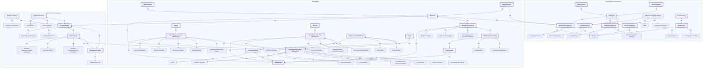

## Thesaurus für ausgewählte Online-Dienste der Stadt Bonn

```mermaid
flowchart TB

  subgraph A["Meldewesen"]
    M["`**Meldewesen**`"]
    W["`**Wohnsitz**`"]
    AM["`**Anmeldung nach dem Meldegesetz**`"]
    UM["`**Ummeldung nach dem Meldegesetz**`"]
    AB["`**Abmeldung nach dem Meldegesetz**`"]
    HW["`**Hauptwohnsitz**`"]
    NW["`**Nebenwohnsitz**`"]
    MB["`**Meldebescheinigung**`"]
    MR["`**Melderegister**`"]
    MRA["`**Melderegisterauskunft**`"]
    OAF["`**Online-Ausweisfunktion**`"]
    PA["`**Personalausweis**`"]
    U["`**Umzug**`"]
    Z["`**Zuzug**`"]
    WG["`**Wegzug**`"]

    WA["Wohnsitz anmelden"]
    WoA["Wohnung anmelden"]
    SA["sich anmelden"]
    AM1["Anmeldung beim Einwohnermeldeamt"]
    AM3["neue Adresse"]
    AM4["Adresse anmelden"]
    AM5["Anmeldung nach Umzug"]

    WU["Wohnsitz ummelden"]
    UM1["Adresse ummelden"]
    UM2["Wohnung ummelden"]
    UM3["Adressänderung"]
    UM5["Umzug beim Bürgeramt melden"]

    WAB["Wohnsitz abmelden"]
    AB1["Wohnung abmelden"]
    AB2["Abmeldung beim Einwohnermeldeamt"]
    AB3["aus Deutschland abmelden"]

    MB1["Meldebestätigung"]
    MB2["Wohnsitzbescheinigung"]
    MB3["Bescheinigung vom Einwohnermeldeamt"]

    MRA1["Meldeauskunft"]
    MRA2["Einwohnermeldeauskunft"]

    PA1["Perso"]
    OAF1["eID-Funktion"]
    OAF2["Online-Ausweis"]
  end

  subgraph C["Eigentum und Unterstützung"]
    WGELD["`**Wohngeld**`"]
    MZ["`**Mietzuschuss**`"]
    LZ["`**Lastenzuschuss**`"]
    WBS["`**Wohnberechtigungsschein**`"]
    GW["`**Geförderte Wohnung**`"]
    SL["`**Sozialleistungen**`"]
    ZWS["`**Zweitwohnungssteuer**`"]
    ST["`**Steuer**`"]
    SE["`**Steuerermäßigung**`"]
    HST["`**Hundesteuer**`"]
    HH["`**Hundehaltung**`"]

    WBS1["WBS"]
    WBS2["Sozialwohnungsschein"]
    GW1["Sozialwohnung"]
    GW2["öffentlich geförderte Wohnung"]
    ZWS1["Zweitwohnsitzsteuer"]
    ZWS2["Nebenwohnsitzsteuer"]
    HA["Hund anmelden"]
    HSA["Hundesteuer anmelden"]
  end

  subgraph D["Aufenthalt und Einbürgerung"]
    AT["`**Aufenthaltstitel**`"]
    EB["`**Einbürgerung**`"]
    STA["`**Staatsangehörigkeit**`"]
    AE["`**Arbeitserlaubnis**`"]
    ABH["`**Ausländerbehörde**`"]

    AG["Aufenthaltsgenehmigung"]
    AT1["Aufenthaltserlaubnis"]
    EB1["deutsche Staatsangehörigkeit beantragen"]
    EB2["Deutscher werden"]
    EB3["deutsche Staatsbürgerschaft beantragen"]
    STA1["Staatsbürgerschaft"]
    AE1["Arbeiten in Deutschland"]
    ABH1["Ausländeramt"]
    ABH2["Amt für Migration"]
  end

  %% NT: Unterbegriff zeigt auf Oberbegriff
  AM -->|NT| M
  UM -->|NT| M
  AB -->|NT| M
  MB -->|NT| M
  MR -->|NT| M
  MRA -->|NT| MR
  HW -->|NT| W
  NW -->|NT| W
  OAF -->|NT| PA

  WGELD -->|NT| SL
  WBS -->|NT| SL
  MZ -->|NT| WGELD
  LZ -->|NT| WGELD
  ZWS -->|NT| ST
  HST -->|NT| ST
  SE -->|NT| ST

  %% UF: PT verweist auf Varianten
  AM -->|UF| WA
  AM -->|UF| WoA
  AM -->|UF| SA
  AM -->|UF| AM1
  AM -->|UF| AM3
  AM -->|UF| AM4
  AM -->|UF| AM5

  UM -->|UF| WU
  UM -->|UF| UM1
  UM -->|UF| UM2
  UM -->|UF| UM3
  UM -->|UF| UM5

  AB -->|UF| WAB
  AB -->|UF| AB1
  AB -->|UF| AB2
  AB -->|UF| AB3

  MB -->|UF| MB1
  MB -->|UF| MB2
  MB -->|UF| MB3

  MRA -->|UF| MRA1
  MRA -->|UF| MRA2
  PA -->|UF| PA1
  OAF -->|UF| OAF1
  OAF -->|UF| OAF2

  WBS -->|UF| WBS1
  WBS -->|UF| WBS2
  GW -->|UF| GW1
  GW -->|UF| GW2
  ZWS -->|UF| ZWS1
  ZWS -->|UF| ZWS2
  HST -->|UF| HA
  HST -->|UF| HSA

  AT -->|UF| AG
  AT -->|UF| AT1
  EB -->|UF| EB1
  EB -->|UF| EB2
  EB -->|UF| EB3
  STA -->|UF| STA1
  AE -->|UF| AE1
  ABH -->|UF| ABH1
  ABH -->|UF| ABH2

  %% RT: bidirektionale Beziehungen
  W <-->|RT| AM
  W <-->|RT| AT
  UM <-->|RT| AM
  AB <-->|RT| AM
  W <-->|RT| MB
  W <-->|RT| ZWS
  NW <-->|RT| ZWS
  U <-->|RT| UM
  Z <-->|RT| AM
  WG <-->|RT| AB
  MB <-->|RT| MRA
  PA <-->|RT| M
  OAF <-->|RT| PA

  WBS <-->|RT| GW
  WGELD <-->|RT| GW
  SL <-->|RT| WGELD
  HH <-->|RT| HST

  AT <-->|RT| EB
  AT <-->|RT| STA
  AE <-->|RT| AT
  ABH <-->|RT| AT
  EB <-->|RT| PA
  EB <-->|RT| STA

  style A fill:#F4F8FF
  style C fill:#F4F8FF
  style D fill:#F4F8FF

  classDef PT stroke-width:3px
  class M,W,AM,UM,AB,HW,NW,MB,MR,MRA,OAF,PA,U,Z,WG,WGELD,MZ,LZ,WBS,GW,SL,ZWS,ST,SE,HST,HH,AT,EB,STA,AE,ABH PT
```
